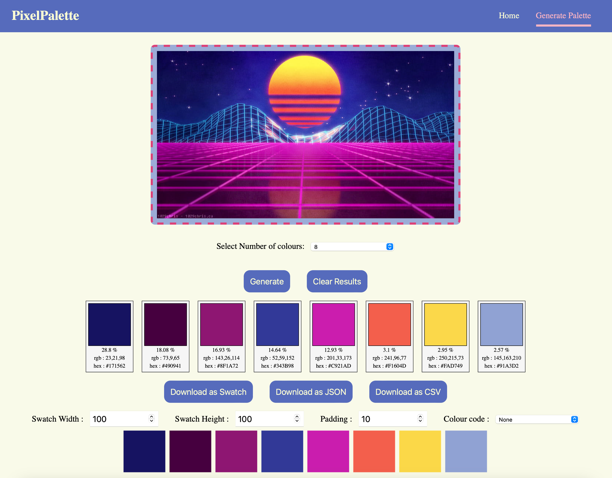

# Pixel Palette

Pixel Palette is a web application designed to extract the most dominant colours from an uploaded image using K-means clustering. The frontend is built with React, while the backend is powered by Flask-Python.

## Features

- **Image Upload**: Users can upload images to analyze colour palette.
- **Colour Extraction**: Select number of colours and extract dominant colours from the uploaded image using K-means clustering.
- **Interactive UI**: User-friendly interface for easy interaction and seamless user experience.
- **Download Options**: Download extracted colour palettes in various formats (JSON, CSV, customizable swatch).

## Usage

1. **Upload an Image**: Use the form to upload an image file and select number of colours required.
2. **Extract Colours**: Click on the "Generate" button to process the image.
3. **View Results**: The extracted dominant colours will be displayed on the screen.
4. **Download Palette**: Download the colour palette in your preferred format - JSON, CSV, or customizable swatch (with live editor).



## Installation

### Prerequisites

- [Node.js](https://nodejs.org/)
- [Python 3.x](https://www.python.org/)
- [Flask](https://flask.palletsprojects.com/)

### Frontend Setup

1. Clone the repository:
    ```bash
    git clone https://github.com/ananyababuprasad/pixelpalette.git
    cd pixel-palette
    ```

2. Navigate to the frontend directory and install dependencies:
    ```bash
    cd frontend
    npm install
    ```

3. Start the React development server:
    ```bash
    npm start
    ```

### Backend Setup

1. Navigate to the backend directory and create a virtual environment:
    ```bash
    cd backend
    python -m venv fl_venv
    ```

2. Activate the virtual environment:
    - On Windows:
        ```bash
        fl_venv\Scripts\activate
        ```
    - On macOS/Linux:
        ```bash
        source fl_venv/bin/activate
        ```

3. Install the required Python packages:
    ```bash
    pip install -r requirements.txt
    ```

4. Start the Flask server:
    ```bash
    flask run
    ```

### Running the Application

1. Ensure both the React development server and Flask server are running.
2. Open your browser and navigate to `http://localhost:3000`.

## Usage

1. **Upload an Image**: Use the form to upload an image file.
2. **Extract Colours**: Click on the "Extract Colours" button to process the image.
3. **View Results**: The extracted dominant colours will be displayed on the screen.
4. **Download Palette**: Download the colour palette in your preferred format (JSON, CSV, or customizable swatch).

## File Structure

```
PIXELPALETTE/
│
├── backend/
│   ├── app.py
│   └── requirements.txt
│
├── frontend/
│   ├── public/
│   │   ├── favicon.ico
│   │   ├── favicon.png
│   │   ├── index.html
│   │   ├── manifest.json
│   │   └── robots.txt
│   ├── src/
│   │   ├── components/
│   │   │   ├── ColourPaletteItem.js
│   │   │   └── Navbar.js
│   │   ├── pages/
│   │   │   ├── GeneratePalette.js
│   │   │   └── Home.js
│   │   ├── App.js
│   │   ├── Background.JPG
│   │   ├── index.css
│   │   └── index.js
│   ├── package.json
│   └── package-lock.json
│
├── .gitignore
└── README.md
```

## Technologies Used

### Frontend

- React: A JavaScript library for building user interfaces.
- Axios: Promise-based HTTP client for making requests to the backend.
- React-Toastify: A React library for adding notifications to the app.

### Backend

- Flask: A lightweight WSGI web application framework in Python.
- Flask-CORS: A Flask extension for handling Cross-Origin Resource Sharing (CORS), making cross-origin AJAX possible.
- NumPy: A library for the Python programming language, adding support for large, multi-dimensional arrays and matrices.
- OpenCV (cv2): A library for computer vision.
- Scikit-learn (KMeans): A machine learning library for Python.
- Imutils: A series of convenience functions to make basic image processing functions such as translation, rotation, resizing, skeletonization, and displaying.

### Algorithm

- K-means Clustering: An unsupervised machine learning algorithm used to partition the image into clusters of pixels based on their color similarity.
